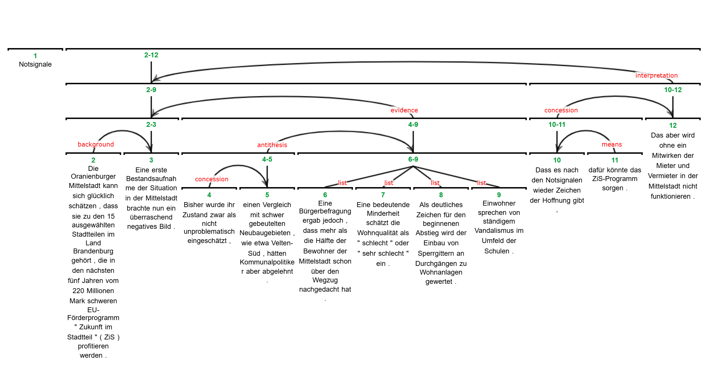
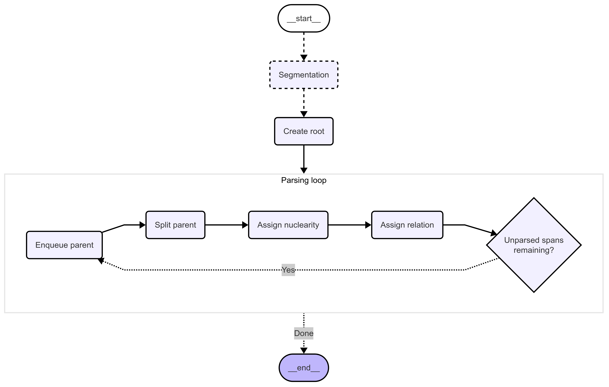

# rst-parsing

## Project Overview

This repository contains the code and data for my semester project in the seminar _Text structures_ at the University of Potsdam. The project investigates the parsing of rhetorical structure in German documents, comparing state-of-the-art neural RST-parsers with a novel approach using _Large Language Models_ (LLMs) and _Structured Outputs_. Research questions, methodology and findings are documented in the accompanying paper, [LLM-based German discourse parsing, leveraging structured outputs](#Project%20report.pdf).

### What is RST?

**Rhetorical Structure Theory (RST)** is a framework for analyzing the organization of text by identifying discourse units and the rhetorical relations between them (e.g., elaboration, contrast, cause). RST trees represent the hierarchical structure of a document, revealing how segments contribute to the overall meaning.

<figure>
  
  <center><figcaption>An RST tree</figcaption></center>
</figure>

### Why is RST Parsing Difficult?

Despite advances in neural parsing, RST parsing remains challenging, especially for non-English texts like German. Key difficulties include:
- **Limited annotated corpora** for languages other than English.
- **Complexity of rhetorical relations** and their linguistic realization.
- **Domain and genre variation** affecting parser generalization.
- **Parser reliance on language-specific features** that may not transfer well.

### What Makes This Approach Unique?

Unlike traditional neural RST-parsers, this project explores the use of LLMs (such as GPT-4) to parse the rhetorical structure of German documents. The approach leverages structured output capabilities of LLMs in a zero-shot-setting, aiming to overcome language-specific limitations.

<figure>
  
  <center><figcaption>LangGraph workflow for top-down construction of an RST tree</figcaption></center>
</figure>

---

## Repository Structure

```bash
rst-parsing/
├── README.md
├── Project report.pdf                          # paper
├── requirements.txt                            # pip requirements
├── environment.yml                             # conda environment
├── data/
│   ├── ...
│   ├── gold_annotations/                       # annotations in .dis & .rs3 format
│   │   ├── apa_1.dis
│   │   ├── apa_1.rs3
│   │   └── ...
│   ├── parsed/                                 # results in .rs3 format
│   │   ├── dmrst/
│   │   |   ├── apa_1_dmrst.rs3
│   │   |   └── ...
│   │   ├── dplp/
│   │   |   └── ...
│   │   ├── llm_presegmented/
│   │   |   └── ...
│   │   ├── llm_with_linebreaks/
│   │   |   └── ...
│   │   └── llm_without_linebreaks/
│   │       └── ...
│   ├── segmented_texts/
│   │   ├── dmrst/                              # DMRST-parser predicts segments & labels
│   │   ├── gold_excluding_disjunct_segments/
│   └── texts/                                  # original raw documents
│       ├── apa_1.txt
│       └── ...
├── resources/                                  # plots from the paper
│   └── images/
└── src/
    ├── DMRST_API_docs.mhtml                    # API-documentation of DMRST-Docker-image
    ├── evaluation.py                           # Evaluation script
    ├── llm_graph.py                            # LangGraph implementation of LLM-parsing logic
    ├── output_formats.py                       # Structured output schemas
    ├── parsing.py                              # Wrapper classes DMRSTParser, DPLPParser, LLMParser
    ├── rst2dis.py
    ├── tree.py                                 # Binary RST-Tree implementation
    └── utils.py                                # Helpers for LLM/ Docker instantiation, file loading & format conversion.
```

---

## How to Reproduce the Experiments

There is no single CLI or `main.py` script. To reproduce the experiments:

1. **Setup the Environment**  
see [Prerequisites](#prerequisites)

2. **Run Neural Parser Experiments**  
```python
from parsing import DMRSTParser, DPLPParser
from utils import load_texts

dmrst = DMRSTParser()
dplp = DPLPParser()

texts = load_texts()
dmrst_res = dmrst.parse(texts)
dplp_res = dplp.parse(texts)
```

3. **Run LLM-Based Parsing**  
For LLM-based parsing, ensure you provide API keys for your chosen provider (see [API Key](#api-key)).
```python
from parsing import LLMParser
from utils import load_texts

llm = LLMParser(
    model: Literal[
        "gpt-4.1",
        "gpt-4o",
        "o4-mini",
        "claude-sonnet-4",
        "claude-3-7-sonnet",
        "claude-3-5-sonnet",
        "claude-3-sonnet",
    ] = "gpt-4.1"
)

texts = load_texts()
segmented_texts = load_texts('data/segmented_texts/gold_excluding_disjunct_segments/')
llm_unsegmented = [res.to_rs3() for res in llm.parse(text=texts.values())]
llm_segmented = [res.to_rs3() for res in llm.parse(edus=segmented_texts.values())]
```

4. **Evaluate Results**  
After parsing, run the main evaluation script:
```bash
python .src/evaluation.py
```

> For the evaluation script to work out-of-the-box, write parse results to `data/parsed/<some_name>/` in the prior step.

---

## Prerequisites

### Python
Version $\geq$ 3.10.\*, $\leq$ 3.11.\*

### Python Packages
Install required packages using pip:
```bash
pip install -r requirements.txt
```
or using conda:
```bash
conda env create -f environment.yml
conda activate rst-parsing
```
### Docker
[Docker Desktop](https://www.docker.com/products/docker-desktop/) and the following images are required if you want to compare the LLM-parsing with existing neural parsers:
```bash
docker pull psandhaas/dmrst-parser
docker pull mohamadisara20/dplp-env:ger
```
Trying to instantiate `DMRSTParser()` or `DPKPParser()` will fail otherwise.

### API Key   
Required for LLM-based parsing. Set your API key as an environment variable or create a `.env`-file.
If you're using an Azure- or AWS-deployment, `./src/utils/_init_llm(...)` will work out-of-the-box. Otherwise, you will have to adapt the function accordingly.

---

## Citations
- Chloé Braud, Maximin Coavoux, and Anders Søgaard. 2017. Cross-lingual rst discourse parsing. arXiv preprint arXiv:1701.02946.
- Lynn Carlson and Daniel Marcu. 2001. Discourse tagging reference manual. ISI Technical Report ISI-TR-545, 54(2001):56.
- Iria Da Cunha and Mikel Iruskieta. 2010. Comparing rhetorical structures in different languages: The influence of translation strategies. Discourse Studies, 12(5):563–598.
- Saibo Geng, Martin Josifoski, Maxime Peyrard, and Robert West. 2023. Grammar-constrained decoding for structured nlp tasks without finetuning. arXiv preprint arXiv:2305.13971.
- Freya Hewett. 2023. Apa-rst: A text simplification corpus with rst annotations. In Proceedings of the
4th Workshop on Computational Approaches to Discourse (CODI 2023), pages 173–179.
- Yangfeng Ji and Jacob Eisenstein. 2014. Representation learning for text-level discourse parsing. In Proceedings of the 52nd annual meeting of the association for computational linguistics (volume 1: Long papers), pages 13–24.
- Zhengyuan Liu, Ke Shi, and Nancy Chen. 2021. DMRST: A joint framework for document-level multilingual RST discourse segmentation and parsing.
In Proceedings of the 2nd Workshop on Computational Approaches to Discourse, pages 154–164, Punta Cana, Dominican Republic and Online. Association for Computational Linguistics.
- Aru Maekawa, Tsutomu Hirao, Hidetaka Kamigaito, and Manabu Okumura. 2024. Can we obtain significant success in rst discourse parsing by using large language models? arXiv preprint arXiv:2403.05065.
- William C Mann and Sandra A Thompson. 1988. Rhetorical structure theory: Toward a functional theory of text organization. Text-interdisciplinary Journal for the Study of Discourse, 8(3):243–281.
- Daniel Marcu. 2000. The theory and practice of discourse parsing and summarization. MIT press.
- Mathieu Morey, Philippe Muller, and Nicholas Asher. 2017. How much progress have we made on RST discourse parsing? a replication study of recent results on the RST-DT. In Proceedings of the 2017 Conference on Empirical Methods in Natural Language Processing, pages 1319–1324, Copenhagen, Denmark. Association for Computational Linguistics.
- Hannah J Seemann, Sara Shahmohammadi, Tatjana Scheffler, and Manfred Stede. 2023. Building a parallel discourse-annotated multimedia corpus. 14–15 September 2023, University of Mannheim, Germany, 8(3):17.
- Sara Shahmohammadi and Manfred Stede. 2024. Discourse parsing for german with new rst corpora. In Proceedings of the 20th Conference on Natural Language Processing (KONVENS 2024), pages 65–74.
- Manfred Stede. 2004. The potsdam commentary corpus. In Proceedings of the Workshop on Discourse Annotation, pages 96–102.
- Manfred Stede. 2016. Handbuch Textannotation: Potsdamer Kommentarkorpus 2.0, volume 8. Universitätsverlag Potsdam.
- Nynke van der Vliet. 2010. Inter annotator agreement in discourse analysis.
- Amir Zeldes. 2016. rstweb-a browser-based annotation interface for rhetorical structure theory and discourse relations. In Proceedings of the 2016 Conference of the North American Chapter of the Association for Computational Linguistics: Demonstrations, pages 1–5.
